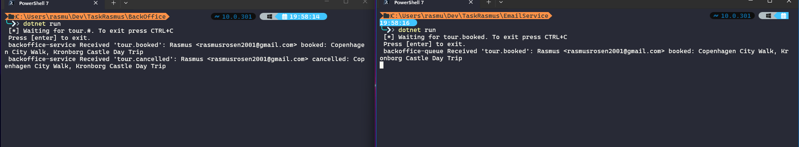

# TaskRasmus

## Publisher: `TourBooking.Web/Components/Pages/Book.razor`

2 EditForms, one for booking and one for cancelling a booking.

Bookings are stored directly in a list in TourBooking.Web, to keep it as scoped as
possible regarding messaging and topic exchange.

## Consumer: `BackOffice/Program.cs`

- Gets all `tour.something` using `tour.#` as routing key
- Consumes from the exchange: `tours`
- Has its own queue: `backoffice-service`

## Consumer: `EmailService/Program.cs`

- Gets only `tour.booked` using `tour.booked` as routing key
- Consumes from the same exchange
- Has its own queue: `backoffice-queue`

The consumers still need the exchange name basically because of starting order relevance.

